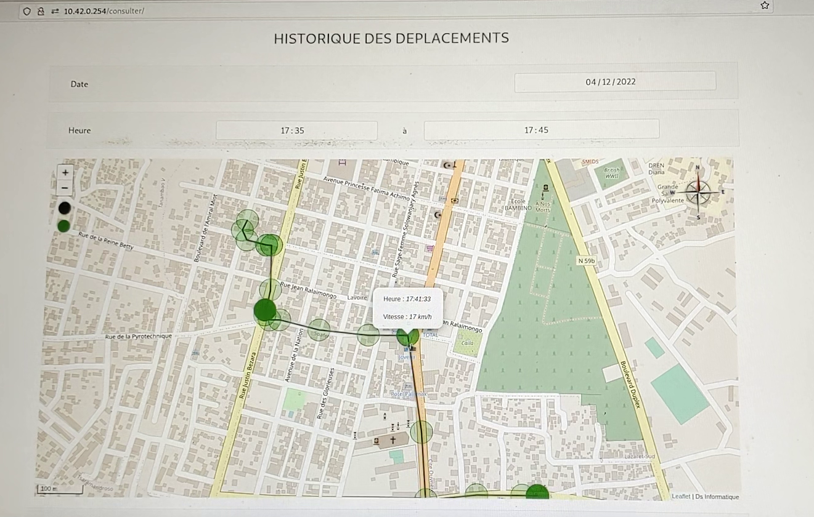
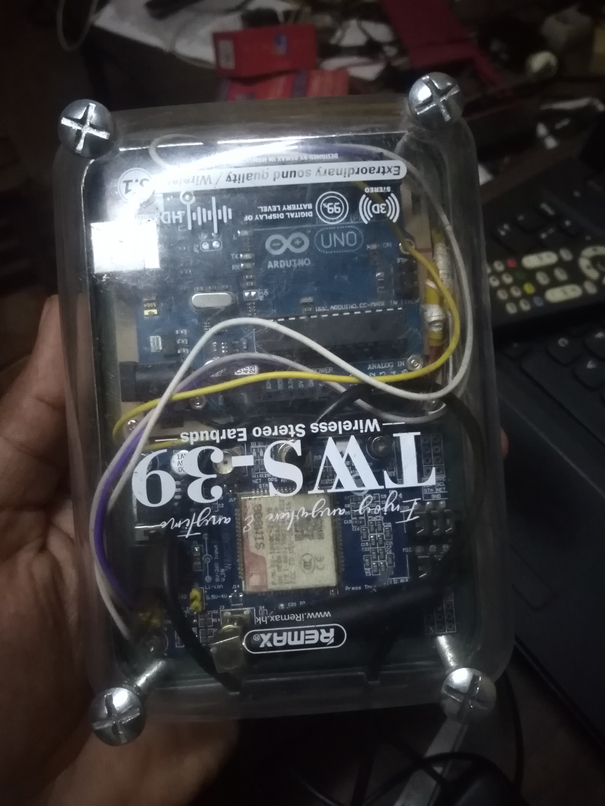
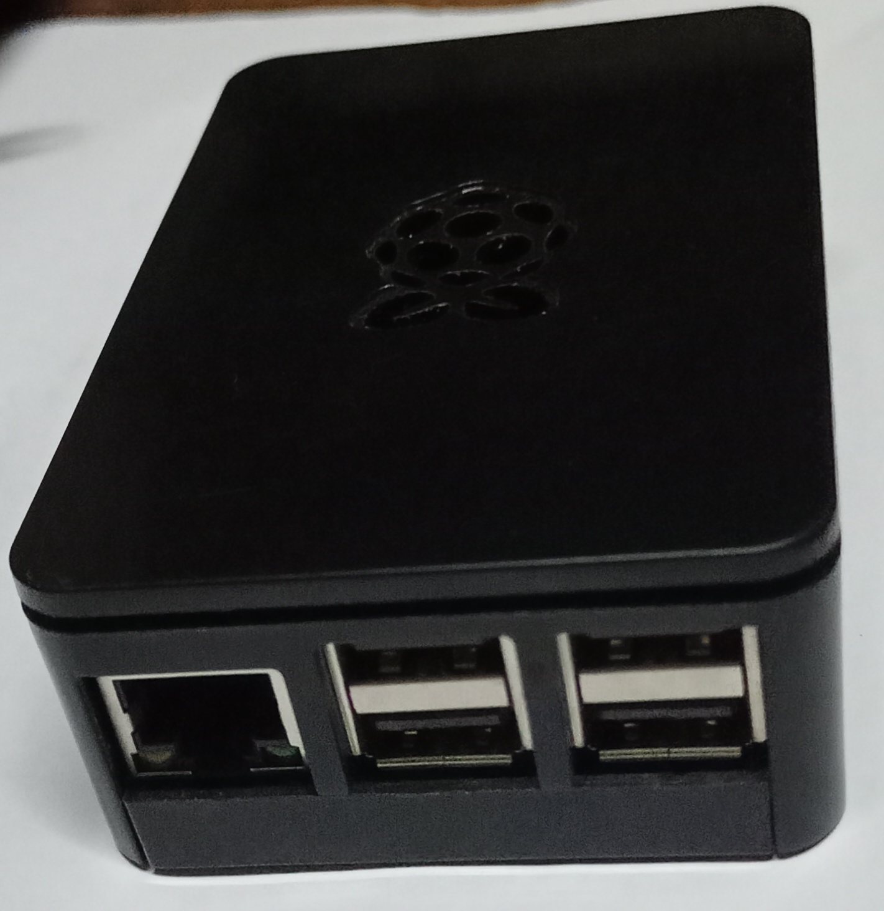

# Géolocalisation de véhicules par GPS + GSM (SMS)

Ce dépôt contient l’ensemble du projet réalisé durant un stage : un **système complet de suivi de véhicules** qui fonctionne **sans Internet côté véhicule**, en envoyant les coordonnées GPS via **SMS** vers une **station de base** (Raspberry Pi).  
La station de base réceptionne les SMS avec modem GSM couplé avec **Gammu**, qui enregistre les positions dans **MySQL** et affiche le suivi sur une **plateforme Web** (Leaflet/OSM).

---

<h3>🖥️ Interface Web(suivi en temps réel & Historique des trajets sur période)</h3>

<div style="display:flex; flex-wrap:wrap; gap:12px;">
  <figure style="margin:0; width:125px;">
    <a href="docs/images/platforme affichage osm.png">
      
    </a>
  </figure>

  <figure style="margin:0; width:125px;">
    <a href="docs/images/historique-deplacement-2.png">
      
    </a>
  </figure>
</div>

<h3>🔧 Matériel</h3>
<div style="display:flex; flex-wrap:wrap; gap:12px;">
  <figure style="margin:0; width:125px;"> 
    <a href="docs/images/design-boitier/IMG_20221204_214359(1).jpg"> 
       
    </a> 
  </figure> 
  <figure style="margin:0; width:125px;"> 
    <a href="docs/images/Raspberry-pi-2-b-plus.jpg"> 
       
    </a> 
  </figure> 
</div>


## 🎯 Objectifs du projet

Le projet répond aux besoins suivants :

- Suivre un véhicule **en temps réel** (ou quasi temps réel) via SMS.
- Stocker les positions dans une base de données pour l’**historique de trajet**.
- Afficher la position et les trajets sur une carte (OpenStreetMap).
- Détecter des comportements : arrêt prolongé, sortie de zone, dépassement de vitesse *(selon configuration)*.

---

## 🧠 Principe de fonctionnement (vue d’ensemble)

1. **Boîtier véhicule (Arduino + SIM808)**  
   - Récupère la position via GPS (commandes AT).  
   - Envoie périodiquement un SMS contenant : `timestamp$lat$lon$alt$vitesse`

2. **Station de base (Raspberry Pi)**  
   - Reçoit le SMS via un modem GSM + Gammu.  
   - Le SMS est enregistré en fichier `IN*.txt` puis traité par un script.  
   - Les données sont insérées dans MySQL.

3. **Plateforme Web**  
   - Lit la base de données et affiche :  
     - la position courante (temps réel)  
     - l’historique des trajets

---

## 🗂️ Structure du dépôt

```text
.
├── vehicle-unit/                          # Boîtier véhicule (Arduino + SIM808)
│   ├── arduino/
│   │   ├── GPS_tracker.ino                # Code principal (commandes AT)
│   │   └── README.md
│   └── wiring/
│       └── connections.md                 # Câblage / alimentation / antennes
│
├── base-station/                          # Station de base (Raspberry Pi)
│   ├── database/
│   │   ├── schema.sql                     # Schéma final MySQL
│   │   └── *.sql                          # scripts / tests
│   │
│   ├── sms-gateway/                       # Réception SMS via Gammu
│   │   ├── gammu/                         # configuration gammu-smsd
│   │   ├── scripts/                       # script.sh et docs
│   │   └── sample_inbox/                  # exemples de IN*.txt
│   │
│   └── web/                               # Plateforme web (consulter/osm/parametre)
│
└── docs/                                  # Rapport + notes + captures
    ├── rapport_stage.pdf
    └── screenshots/
```

---

## 📩 Format des SMS & fichiers entrants

### Exemple de contenu d’un SMS reçu
```text
20221204152330.000$-12.291685$49.296335$179$0
```

### Exemple de nom de fichier Gammu
```text
IN20221204_182344_00_+261324049847_00.txt
```

- Les champs sont séparés par le caractère `$`.
- Le fichier est généré automatiquement par **gammu-smsd** puis traité par `script.sh`.

---

## ⚙️ Installation rapide (station de base)

> Les étapes exactes peuvent dépendre de ta distribution (Raspberry Pi OS / Debian).

### 1) Installer les dépendances
- Apache / PHP
- MySQL (ou MariaDB)
- Gammu + gammu-smsd

### 2) Importer la base de données
Depuis `base-station/database/` :

```bash
mysql -u root -p < schema.sql
```

### 3) Configurer Gammu
Le fichier de configuration est dans :

- `base-station/sms-gateway/gammu/gammu-smsdrc`

Puis activer le service :

```bash
sudo systemctl enable gammu-smsd
sudo systemctl restart gammu-smsd
```

### 4) Déployer la plateforme web
Copier `base-station/web/` vers le répertoire web (ex. `/var/www/html/`) et adapter la configuration (connexion DB).

---

## 🚗 Boîtier véhicule (Arduino + SIM808)

Le code Arduino est dans :

- `vehicle-unit/arduino/GPS_tracker.ino`

### Bibliothèques
- `SoftwareSerial` est utilisée.
- La bibliothèque `DFRobot_SIM808` a été testée mais des bugs ont été rencontrés, donc les **commandes AT sont gérées manuellement** dans le code.

---

## 🧪 Tests & validation
- Réception correcte des coordonnées via SMS.
- Stockage dans MySQL.
- Consultation des positions via l’interface web.

---

## 🎥 Démonstrations vidéo

- **Déplacement instant t (temps réel)** : https://drive.google.com/file/d/1C9A64Omml7m4T1t1LQc_CR_4eoGPimuf/view
- **Affichage historique de déplacement** : https://drive.google.com/file/d/1P7QXlxR4oFfpXqTBOEUMRbK0RXWegbxK/view


## 📄 Documentation
- Notes et sauvegardes : `docs/*.txt`
- Images du boitier conçu : `docs/images/`

---

## 👤 Auteur
Projet réalisé par **ANDRIANJARA Jacob Rino** au cours d'un stage en 2022, mais finalement publié en Décembre 2025 dans un cadre de mise à jour d'un portfolio personnel.

---

## 🪪 Licence
Ce projet est distribué sous licence **MIT** (voir le fichier `LICENSE`).
